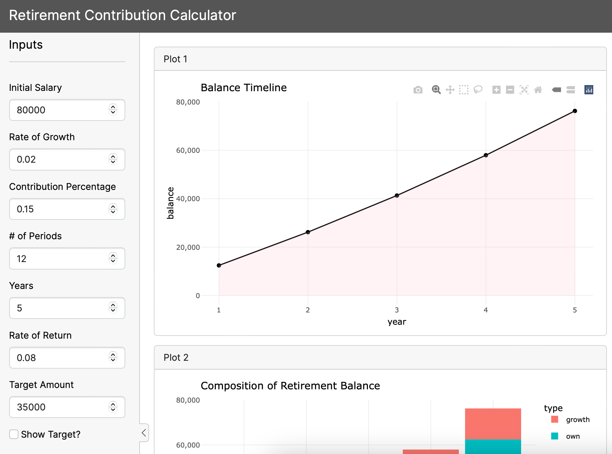

## Retirement Contribution Calculator 


The idea is to create a calculator to see how much money you could accumulate in
your employer retirement plan (or other similar retirement account) over time by
making periodic contributions from each paycheck.




1) __initial salary__: default value 80000.

2) __rate of growth__: this corresponds to the annual salary's rate of growth;
default value 0.02 (i.e. 2%)

3) __contribution percentage (i.e. savings rate)__: the percentage of salary 
that is contributed to the retirement plan every year; default value 0.15 (i.e. 15%)

4) __number of periods__: this corresponds to the number of periodic 
contributions in a year; default 12 (monthly contributions)
    + annually: k=1
    + semi-annual: k=2
    + quarterly: k=4
    + bimonthly: k=6
    + monthly: k=12
    + weekly: k=52

5) __years invested__: number of years; default = 5.

6) __annual rate of return__: expected (average) annual rate of return (this
is the return of investments); default value 0.08 (8%)

7) __target amount__: optional target amount; default value 35000

8) __show target__: by default, no mark for the target amount will be displayed
in the plots, but the user should be allowed to display a mark to visualize this 
amount.


## Running the app


To run the app in Rstudio, execute the following code in R:


```r
library(shiny)

# Run an app from a subdirectory in the repo

runGitHub(
  repo = "calculator-app",
  username = "jazmmiine")
  
```

## Author 

Jazmine Gamboa 

[jazmine-gamboa.quarto.pub](https://jazmine-gamboa.quarto.pub)